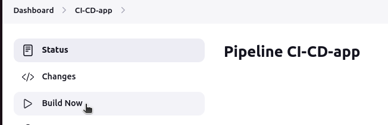

# Final-Project-CI-CD


## Before you start

- you will need an amazon account credentials **(access key id & secert access key id)**.
- create key pair from your aws console, download the key and move it to project directory.
- edit this file **(Terraform/Ec2/main.tf)** to match your paths\
    line 17 and line 23


## Terraform Step

- In this step you will build infrastrucre of the cloud server

```
cd Terraform/
```
```
terraform init
```
```
sudo terraform apply
```

## SSH Step

- In this step you will ssh to the public instance and the private worker node and do some commands to deploy jenkins on the private worker node. also you will install docker daemon on the node.

```
ssh bastion
```
```
aws configure
```
- now enter your aws credntials , do not add any default region or output format.
```
kubectl create -Rf /home/ubuntu/
```
```
kubectl create -Rf /home/ubuntu/
```
- now enter this command to get load balancer url.
```
kubectl get svc -n jenkins-ns
```
- take the external-ip and open jenkins from your browser . It will ask you for jenkins password, to get follow :
```
kubectl get pods -n jenkins-ns
```
- copy pod name and replace <jenkins_name> with it
```
kubectl exec -it pod/<jenkins_name> bash -n jenkins-ns
```
```
cat /var/jenkins_home/secrets/initialAdminPassword
```
- copy the password and inseret it in your browser. 
- install suggested plugins and create a root user.
- jenkins should be up and running now back to the terminal of your local.
- now you will need to ssh to the private node and install docker daemon.
```
ssh remote-host
```
```
sudo yum update -y
```
```
sudo service docker start
```
```
sudo systemctl enable docker.service
```
- now you are done with ssh.

## CI/CD Step

- In this step you will configure jenkins to build a pipeline and deploy a python application.\
credits : https://github.com/atefhares/DevOps-Challenge-Demo-Code

- Follow these steps\
\
\
\

### - add docker credentials:

### - back to your dashboard and create a pipeline:
\

### - make sure to choose **script from scm** , **master branch** and add this repo:
```
https://github.com/abdelkhalek97/Final-Task-Application.git
```

\


### - Copy dns-name from console-output of the build:

- enter the dns name in browser, the application up and running.
\

### Important for destroying the project

- enter aws console/ec2/loadbalncers and delete the two loadbalancers.
- enter this command while you are in Terraform directory:
```
terrform destroy
```
- **note if terraform destruction is stuck you can check if the loadbalancers are deleted from the console.**


